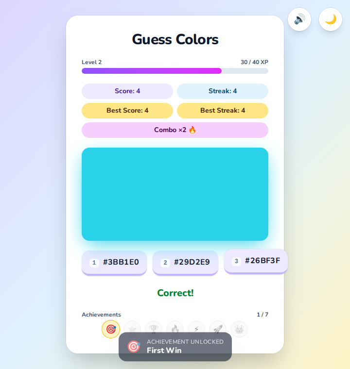
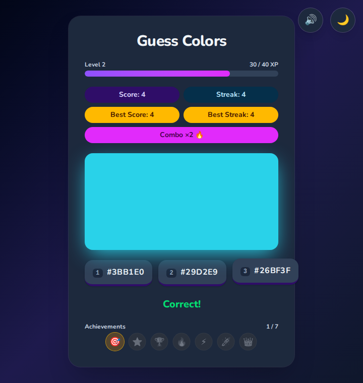

<div align="center">

# 🎨 Guess the Colors

**A polished, gamified color-recognition game — built to production standards in React + TypeScript.**

[**▶ Play the live demo**](https://omkarkirpan.github.io/GuessColors/)

[](https://github.com/OmkarKirpan/GuessColors/actions/workflows/node.js.yml)


</div>

---

## Screenshots

|                    Light                     |                    Dark                     |
| :------------------------------------------: | :-----------------------------------------: |
|  |  |

*Level progression, XP bar, score/streak, combo multiplier, achievements, confetti, and toast notifications — all shown mid-game.*

---

## What it is

A colored swatch appears with three hex-labelled buttons; pick the one that
matches. Simple to grasp, but wrapped in a full progression system so it keeps
pulling you back — the wrong options get **measurably closer** to the target
color the better you play.

### 🕹️ How to play

- A colored box is shown with three color options.
- Click the matching color — or press **1**, **2**, or **3** on your keyboard.
- Correct answers build your **score**, **streak**, and **XP**; wrong answers
  reset the streak.
- Your **best score**, **best streak**, level (XP), and unlocked achievements
  are saved locally, so progress and difficulty carry across visits.

---

## ✨ Technical Highlights

The interesting part isn't the game — it's how it's built. Everything below is
in the repo, tested, and typed.

- **Clean logic / presentation separation.** All game state and orchestration
  live in a single custom hook — [`src/hooks/useGuessColorsGame.ts`](./src/hooks/useGuessColorsGame.ts) —
  while [`src/App.tsx`](./src/App.tsx) is pure composition over ~13 small,
  focused presentational components. UI stays declarative and trivial to test.

- **A real progression system, not just a counter.** Each correct answer awards
  `BASE_POINTS × comboMultiplier`; points accumulate as XP, which drives **level**,
  which drives **difficulty**. The multiplier climbs with the streak (up to ×5).
  Math is isolated and unit-tested in [`src/utils/levels.ts`](./src/utils/levels.ts).

- **Adaptive difficulty via color math.** [`generateDistractor`](./src/utils/color.ts)
  does genuine **HSL ↔ hex** conversion and nudges wrong options toward the
  target's own hue/saturation/lightness — the window narrowing as difficulty
  rises — all clamped to a vivid mid-tone gamut so swatches stay legible on both
  themes. Level 1 is deliberately unchanged, keeping the game approachable (and
  seeded tests deterministic).

- **Achievements as pure predicates.** Each badge in
  [`src/utils/achievements.ts`](./src/utils/achievements.ts) is a pure function
  over a game snapshot, so unlocks are declarative and every one is testable in
  isolation.

- **Resilient persistence.** [`src/utils/stats.ts`](./src/utils/stats.ts) reads
  and writes `localStorage` defensively — it validates shape, tolerates
  **legacy save formats** (missing fields fall back to defaults; a removed
  `bestLevel` field is ignored), and degrades gracefully when storage is
  unavailable (private browsing, quota).

- **Accessibility & motion-respect are first-class.** `MotionConfig
  reducedMotion="user"`, full keyboard play, ARIA live regions for results,
  light/dark theming, and a **dedicated axe-core** end-to-end accessibility
  suite that fails CI on violations.

- **Testing rigor.** Vitest + React Testing Library cover every utility and
  component, Playwright drives five end-to-end specs (game flow, keyboard,
  theming, animations, accessibility), and **90% coverage thresholds** are
  enforced in [`vite.config.ts`](./vite.config.ts).

---

## 💻 Tech Stack

| Area          | Tools                                             |
| ------------- | ------------------------------------------------- |
| Framework     | React 18, TypeScript                              |
| Build         | Vite 6                                            |
| Styling       | Tailwind CSS v4, Nunito (variable font)           |
| Animation     | Motion (`motion/react`)                           |
| Unit testing  | Vitest, React Testing Library                     |
| E2E / a11y    | Playwright, axe-core                              |
| Lint / format | Biome                                             |
| Tooling       | pnpm                                              |

---

## 📂 Project Structure

```
src/
├── hooks/useGuessColorsGame.ts   # all game state, logic & orchestration
├── components/                   # presentational UI (ColorSwatch, ScoreBoard,
│                                 #   XpBar, Confetti, AchievementToast, …)
├── utils/
│   ├── color.ts                  # HSL↔hex, random colors, adaptive distractors
│   ├── levels.ts                 # XP curve, levels, combo multiplier
│   ├── achievements.ts           # badge predicates
│   └── stats.ts                  # resilient localStorage persistence
├── types.ts                      # shared types
└── App.tsx                       # composes the hook + components
e2e/                              # Playwright end-to-end + axe-core a11y tests
```

---

## 🖥️ Development

```bash
git clone https://github.com/omkarkirpan/GuessColors.git
cd GuessColors
pnpm install
pnpm run dev
```

### Useful commands

| Command                  | What it does                                        |
| ------------------------ | --------------------------------------------------- |
| `pnpm run dev`           | Start the dev server                                |
| `pnpm run build`         | Type-check and build for production                 |
| `pnpm run preview`       | Preview the production build locally                |
| `pnpm test`              | Run the unit test suite                             |
| `pnpm run test:coverage` | Run unit tests with a coverage report               |
| `pnpm run e2e`           | Run end-to-end + accessibility tests (Playwright)   |
| `pnpm run e2e:ui`        | Run e2e tests in Playwright's interactive UI        |
| `pnpm run lint`          | Check linting and formatting (Biome)                |
| `pnpm run lint:fix`      | Fix linting and formatting issues in place          |

---

## 🚀 Deployment

Automatically deployed to **GitHub Pages** on every push to `main`.

## 📝 Changelog

See [CHANGELOG.md](./CHANGELOG.md) for a history of notable changes.

## ✒️ Author

Created by **Omkar Kirpan**. Contributions and issues are welcome on the
[GitHub repository](https://github.com/omkarkirpan/GuessColors).
